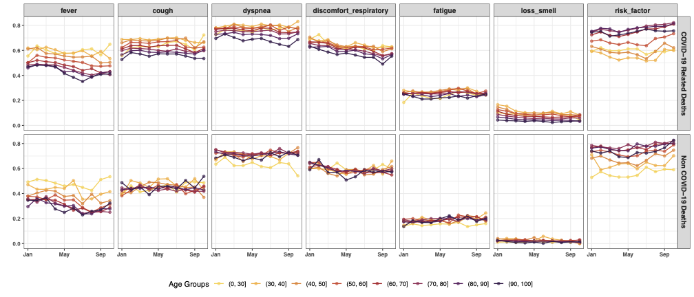
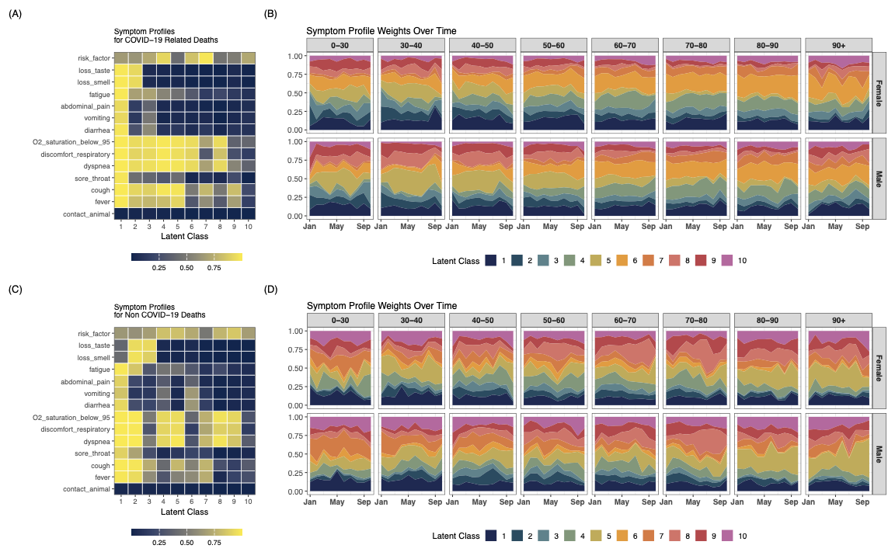
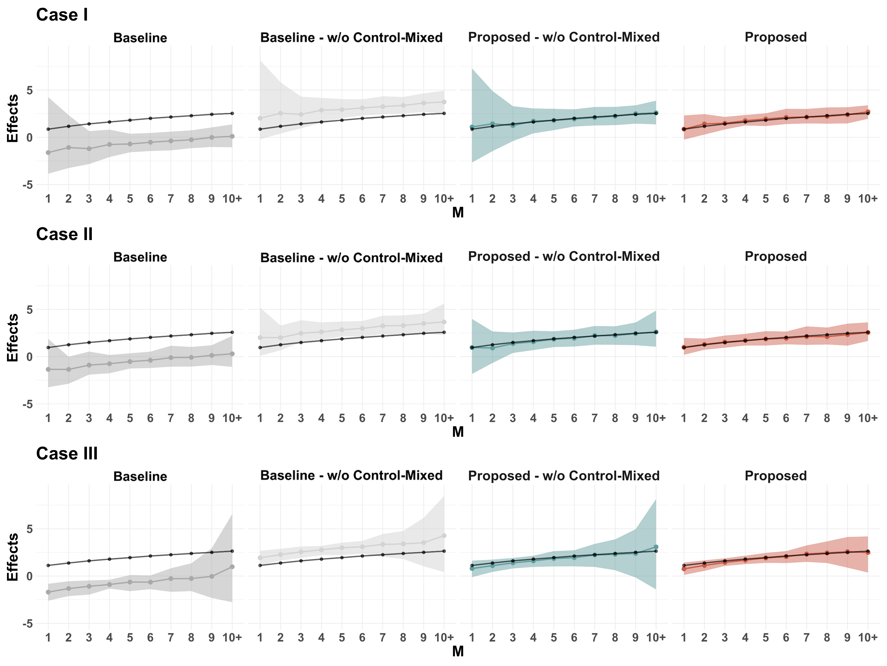
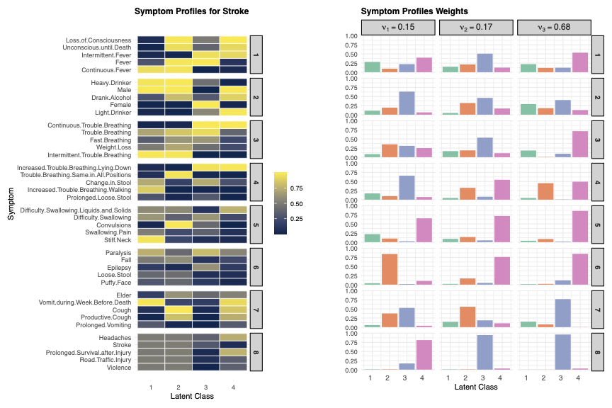
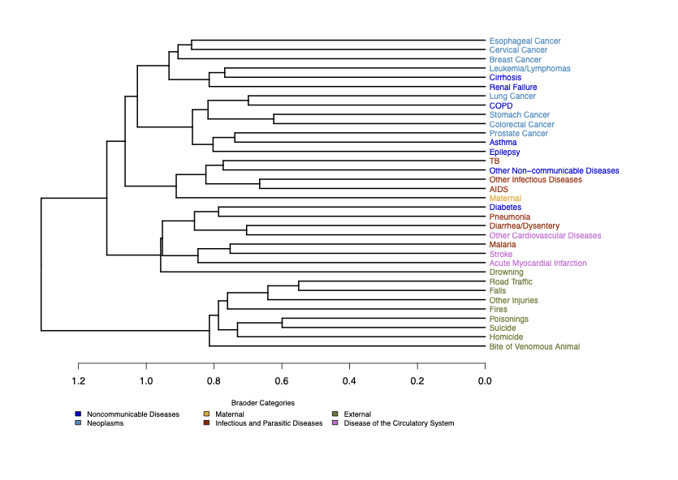

## Hierarchical Latent Class Models for Mortality Surveillance

### Overview
Monitoring causes of death is crucial for understanding disease burdens and shaping public health interventions. In many low-resource settings, **verbal autopsy (VA)** is the primary tool for cause-of-death surveillance, relying on structured interviews with caregivers of the deceased. However, existing VA models often require **extensive domain knowledge** or **large labeled datasets**, making them **ill-suited for emerging diseases** with rapidly evolving epidemiological patterns.

    

### Our Contribution
In our research, we propose a **Bayesian hierarchical latent class model** that accounts for **partially verified VA data**, enabling robust **cause-of-death estimation** under real-world data constraints. Key innovations include:

- **Hierarchical Latent Class Modeling**  
  - Captures the joint distribution of symptoms and their shifts over time and across subpopulations.
  - Accounts for **selective verification bias**, a common issue where cause-of-death verification is **not randomly assigned**.

- **Structured Priors for Improved Estimation**  
  - Incorporates **domain adaptation techniques** to refine estimates for **small subpopulations**.
  - Allows for **flexible borrowing of information** across related demographic groups.

- **Application to COVID-19 Surveillance in Brazil**  
  - We apply our model to **COVID-19 mortality data** in Brazil (2021), demonstrating how traditional models suffer from bias under selective verification.
  - Our method produces **more accurate prevalence estimates** compared to existing approaches.
 

    

 

### Why This Matters
- **Adaptable to Future Public Health Crises**  
  - The framework can be **quickly deployed for new diseases** where **symptom-cause relationships are initially unknown**.
  
- **More Reliable Mortality Estimates**  
  - Reduces **bias** from non-random cause-of-death verification, critical for **global disease surveillance**.

- **Bridging Statistical Innovation with Real-World Impact**  
  - This research integrates **Bayesian inference**, **semi-supervised learning**, and **domain adaptation** to enhance **public health decision-making**.

### Read More
📄 **[Full Paper: Hierarchical Latent Class Models for Mortality Surveillance](#)** *(https://arxiv.org/abs/2410.09274)*

________________________________________________________________________________________________________________________________________

## Treatment Effect Estimation in Dynamic Network Environments [CODE@MIT, 2024]

### Overview
Online multiplayer games introduce **complex interactions** among players, making it difficult to assess the true impact of game features. Traditional **A/B testing** methods, which assume **no interference among units (SUTVA)**, fail in these settings due to the **dynamic and ephemeral network structures** formed during gameplay.

In this research, we address the challenges of **network interference** in online gaming experiments and propose a **novel treatment effect estimator** that enables **post-hoc interference adjustment** in randomized experiments.

### Key Challenges
- **Dynamic Network Structure**  
  - Unlike traditional social networks, online gaming networks **continuously change** as players match into transient teams.
  - Players may participate in **multiple games**, making their exposure to treatment **vary across sessions**.

- **Violation of SUTVA**  
  - Player experience is **influenced by teammates**, causing **spillover effects** that bias traditional A/B testing.
  - Treatment assignment may be **overwritten by team formation rules**, altering true exposure.

- **Scalability and Feasibility**  
  - Running **cluster-based** or **hierarchical randomized experiments** is **computationally expensive** and **logistically impractical** in large-scale online games.

### Our Contribution
To address these challenges, we propose a **causal inference framework** specifically designed for **dynamic online gaming environments**.

- **Novel Treatment Effect Estimation Under Network Interference**  
  - We develop a **general exposure mapping** function that models how treatment spreads through **dynamic team formations**.
  - Our approach allows **post-hoc adjustment of interference** while preserving the simplicity of **randomized experimental designs**.

- **Robust Statistical Estimators**  
  - We introduce an estimator that accounts for **varying levels of exposure** to treatment.
  - The method leverages **Inverse Probability Weighting (IPW)** to correct for biased exposure distributions.

- **Empirical Validation with Real Gaming Data**  
  - We test our framework on a **Tencent mobile gaming experiment** involving **58,565 players** over two weeks.
  - Results show that **naïve estimators** significantly **underestimate treatment effects**, while our method **corrects for interference bias**.
    

    

### Why This Matters
- **Generalizable to Other Dynamic Network Settings**  
  - The framework applies beyond gaming to areas like **social media, online marketplaces, and ad campaign experiments**.

- **Reduces Experimentation Costs**  
  - Enables **more efficient experimental designs** without needing **complex cluster-based interventions**.

- **Improves Decision-Making in A/B Testing**  
  - More reliable treatment effect estimates help **game developers** optimize **new feature rollouts**.

### Read More
📄 **[Full Paper: Treatment Effect Estimation Amidst Dynamic Network Interference](#)** *(https://arxiv.org/abs/2402.05336)*  

________________________________________________________________________________________________________________________________________
## Bayesian Tensor Decomposition for Verbal Autopsy Analysis

### Overview
Accurate **cause-of-death estimation** is critical for understanding disease burdens and shaping public health policy, especially in **low-resource settings** where medical certification of deaths is often unavailable. **Verbal autopsy (VA)** is a widely used alternative, relying on interviews with caregivers to infer the probable cause of death.

Traditional VA models often use **latent class models**, which assume that symptoms are **conditionally independent** given the cause of death. However, real-world symptom distributions exhibit **complex dependencies**, making them **hard to interpret** and potentially limiting their accuracy.

### Our Contribution
We propose a **Bayesian hierarchical tensor decomposition** framework that balances **predictive accuracy** with **interpretability** in VA cause-of-death estimation.

Key innovations include:

- **Flexible Probabilistic Tensor Decomposition**
  - Models **grouped symptom dependencies** to improve interpretability.
  - Uses **hierarchical Bayesian modeling** for better generalization.

- **Dimension-Grouped Factorization**
  - Introduces **r-group independent PARAFACs** and **c-Tucker decomposition** to represent symptom clusters.
  - Improves **latent class interpretability** by structuring **sub-profiles of symptoms**.

- **Scalable Bayesian Inference**
  - Implements an **efficient Markov Chain Monte Carlo (MCMC) approach** for model estimation.
  - Balances **accuracy and computational feasibility** for large datasets.

### Key Results
We evaluate our method on **simulated and real-world VA data**, including the **PHMRC gold-standard dataset**, showing that:

- **Our Bayesian tensor decomposition model improves accuracy** in cause-of-death estimation.
- **Grouping symptoms** enhances interpretability without sacrificing predictive power.
- **Comparison with baseline models (LCVA, InSilicoVA, standard PARAFAC)** confirms our approach is both **more robust and generalizable**.

    

### Case Study: PHMRC Gold-Standard VA Dataset
We applied our model to **7,841 adult deaths across 34 causes** from the PHMRC dataset, demonstrating:

- **Improved cause-of-death classification** compared to existing methods.
- **Clearer latent symptom clustering**, making VA-based mortality modeling more interpretable.

#### **Learned Symptom Clustering**
The model identifies **distinct symptom groups** that correlate with specific diseases, reducing the complexity of high-dimensional VA data.

#### **Cause-of-Death Relationships**
Hierarchical clustering of causes based on symptom structures reveals **intuitive groupings**, such as cardiovascular diseases forming a distinct cluster.

    

### Why This Matters
- **More Accurate Mortality Estimates**  
  - Reduces bias from **simplistic symptom independence assumptions**.  

- **Improved Interpretability for Public Health Policy**  
  - Helps **health organizations** better understand disease relationships.  

- **Scalable Bayesian Framework for Future VA Research**  
  - Enables more **generalizable models** across different datasets and populations.

### Read More
📄 **[Full Paper: Bayesian Tensor Decomposition for VA](#)** *(https://arxiv.org/abs/2502.00171)*  

